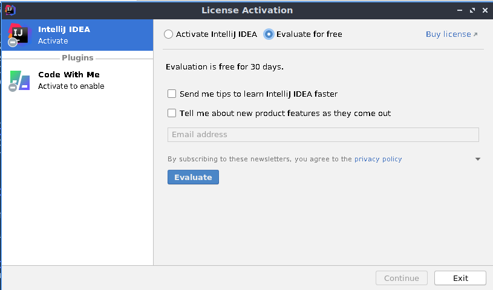
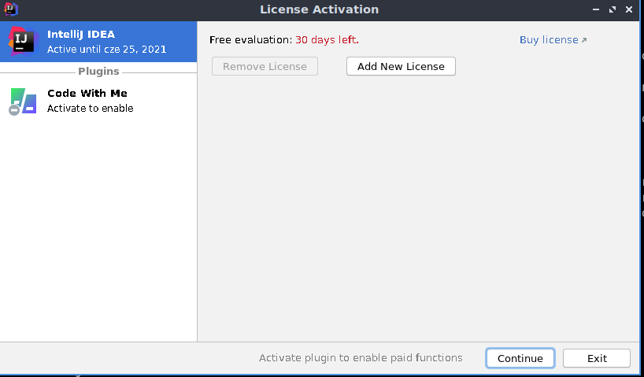
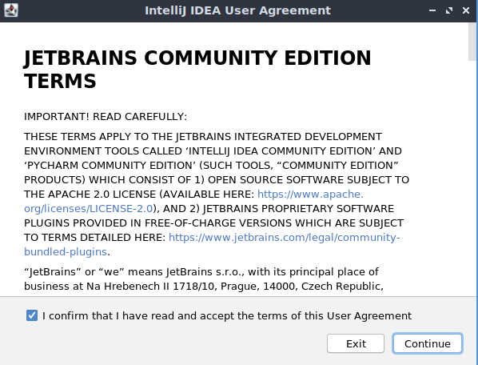
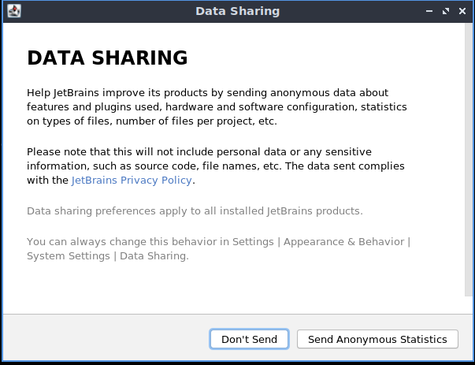
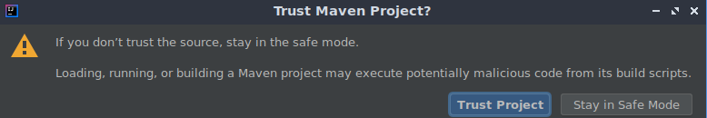
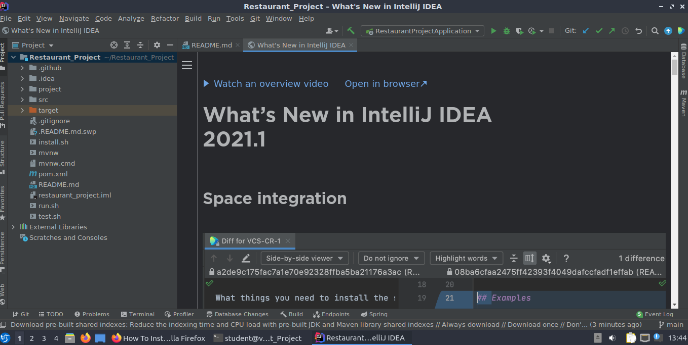
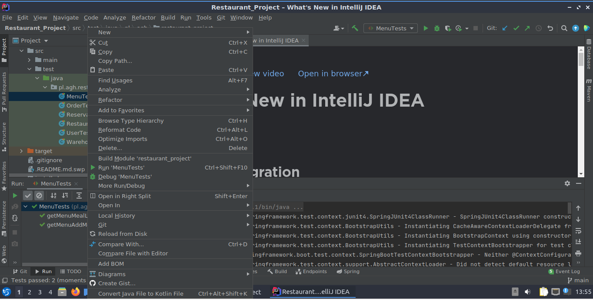

# Restaurant Management Project

**This the project of a web application created in Spring Boot to manage the restaurant. Deploy is created with GitHub Actions and Azure Web Service. The database is also hosted on Azure**


## There are 3 ways to run our project:
### 1. Just check the app website!
>The app is deployed on Azure Web Service, therefore you can check its functionality on a 
[page](https://thepierogi.azurewebsites.net/).
### 2. Use included scripts to run and test app locally
>We've prepared three scripts:
   - install.sh - installs all necessary software, should be executed as first.
   - run.sh - compiles and runs the application
   - test.sh - runs all tests
### 3 .With IDE
><em>Below instruction was created on Lubuntu 20.04.</em>
- Firstly, we need some IDE. Our project was created fully in **IntelliJ IDEA Ultimate**, that's why to run it locally we ought to start with:<br>```sudo snap install intellij-idea-ultimate --classic```<br>After installation you should see something like that:<br><br><br>
- Next, we need to click "Evaluate" and "Continue"<br><br>
- Let's accept JetBrains rules...
  
- Now from parent directory... <br>```cd Restaurant_Project/```<br>```intellij-idea-ultimate ./```<br>And if you trust our team, click "Trust Project" :) 
- Wait few minutes... <br>After indexing and downloading Maven dependencies, the interface should look like that: 
  To run a program just click on a green arrow, available next to the box with text <em>"RestaurantProjectApplication"</em>.
- To run all tests just use simple buttons combination: <em>Ctrl+Shift+F10</em>. If you want to execute a specific test, in the project explorer go to <em>src/test/java/pl.agh.restaurant/</em> and click with the right mouse button on the chosen test. Next, you must press Run "test_name" <br><br>
# NOTES
- If prompt about JDK 16 appears, just let it install automatically 
- The application is deafulty starting on port 8080, if you want run it on other port just paste ```server.port=port_number``` to <em>application.properties</em> file.
- To get login and password to platform, contact with creators